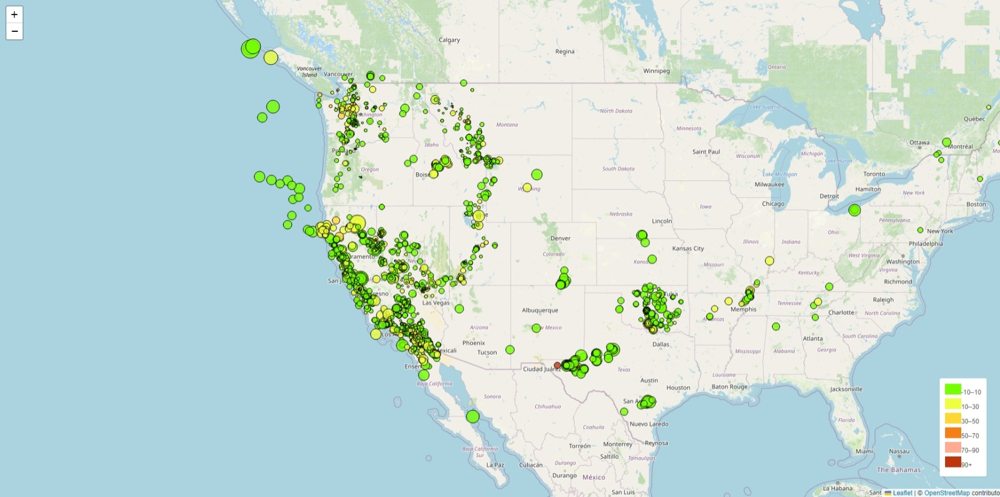
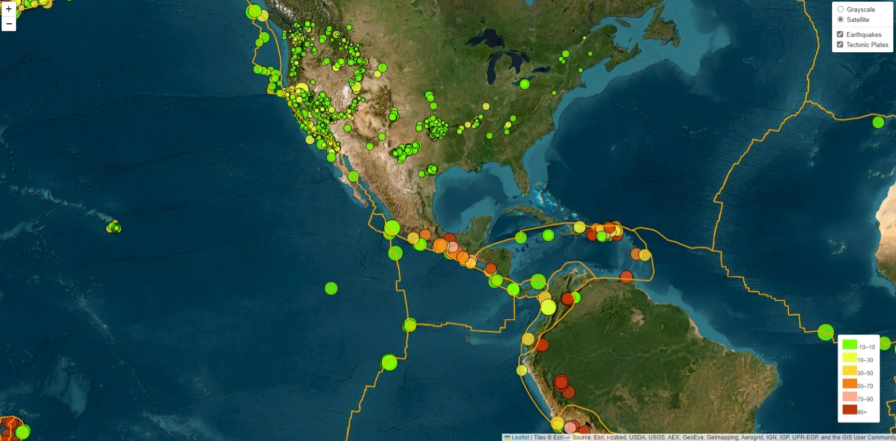

# Earthquake and Tectonic Plate Visualization using Leaflet

## Project Overview

This project aims to visualize real-time earthquake data and tectonic plate boundaries on a world map using Leaflet.js. The map offers interactive features, allowing users to explore the earthquake occurrences and their depths across the globe. It also provides layer controls for users to toggle between Earthquakes layer, and Tectonic Plates layer as well as different map views such as Grayscale, and Satellite.

This repository contains `Leaflet-Part-1` and `Leaflet-Part-2`. `Leaflet-Part-1` contains the html,css and javascript code for visualising the earthquake whereas `Leaflet-Part-1` contains similar files for the interactive visualisation of both earthquake and the tectonic plates. 

## Features

- **Real-Time Earthquake Data**: Visualizes the most recent earthquake data from the USGS Earthquake Catalog API.
- **Tectonic Plate Boundaries**: Displays the tectonic plate boundaries fetched from [github]("https://github.com/fraxen/tectonicplates/tree/master").
- **Interactive Layers**: Offers toggle controls for Grayscale, Satellite, Earthquakes, and Tectonic Plates layers.
- **Customizable Legends**: Provides a color-coded legend indicating the depth of earthquakes.
- **Popups**: Displays detailed information about each earthquake, such as magnitude and depth, on clicking the earthquake markers.




## Technologies Used

- **Leaflet.js**: JavaScript library for interactive maps.
- **D3.js**: JavaScript library for manipulating documents based on data.
- **HTML/CSS**: Structuring and styling the web page.
- **USGS Earthquake Catalog API**: Source of real-time earthquake data.

## Setup and Usage

1. **Clone the Repository**
   ```sh
   git clone `https://github.com/Beautyojimah/Leaflet-challenge.git`
   cd `Leaflet-challenge`

2. **Open the HTML File**
    Navigate to folder of interest (`Leaflet-Part-1` or `Leaflet-Part-2`)
    Open the `index.html` file in a web browser.

3. **Explore the Map**
    - Use the map controls to zoom in/out and navigate across the map.
    - Toggle between Grayscale and Satellite views using the layer controls.
    - Enable/Disable the Earthquakes and Tectonic Plates layers using the layer controls.
    - Click on the earthquake markers to view detailed information.

## Data Sources
    - [Earthquake](https://earthquake.usgs.gov/earthquakes/feed/v1.0/geojson.php "Earthquake data:")
    - [TectonicPlate](https://raw.githubusercontent.com/fraxen/tectonicplates/master/GeoJSON/PB2002_plates.json "Tectonic Plate data:")
